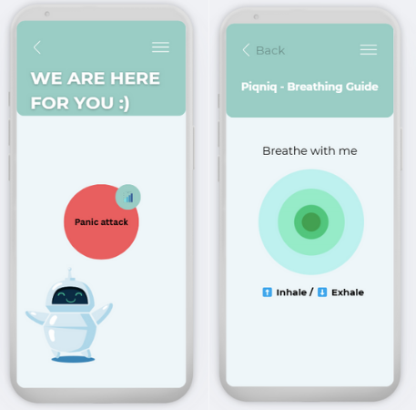

# PiqNiq - Your Calm in Crisis

## 🥈2nd Place Winner – BGSU Hackathon 2025

## introduction
[Demo vedio](https://drive.google.com/file/d/1s3NS_7rpyfJdbhtVnTh_A6TkKEPe6U77/view?usp=drivesdk)
## About Piqniq
**Piqniq** is an emergency alert app designed to support individuals during panic attacks.  
With just one tap, users can notify trusted contacts and share their live location — all while being guided by a calming, intuitive interface.
## ✨ Key Features

- 🚨 **One-Tap Emergency Alert**  
  Instantly alerts emergency contacts and shares the user’s location.

- 🌿 **Soothing UI + Virtual Agent**  
  A calming screen with a friendly assistant reassures the user while help is on the way.

- 📈 **Panic History Tracker**  
  Helps users reflect and discover patterns in their panic episodes.

- ⌚ **Future Vision**  
  Smartwatch integration to detect biometric signals and predict panic attacks before they start.

